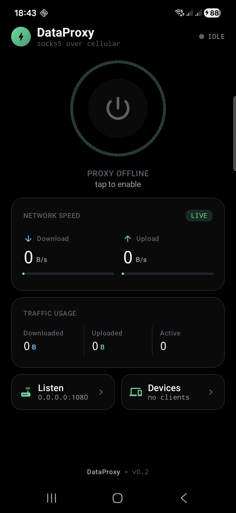

<div align="center">


# DataProxy

**Turn your Android phone into a SOCKS5 proxy whose traffic always goes out over mobile data.**

[](https://github.com/Sir-MmD/dataproxy/releases/latest)
[](LICENSE)
[](https://developer.android.com)
[](https://kotlinlang.org)

</div>

## What it does

Your laptop (or any device on the same Wi-Fi) points its SOCKS5 settings at
`phone-ip:1080`. DataProxy listens there, and pins every outbound socket to
the phone's **cellular** network — so the egress goes through mobile data even
when Wi-Fi is the default. Other apps on the phone are untouched; only the
sockets DataProxy creates are pinned.

```
laptop  ── SOCKS5 over Wi-Fi ──▶  📱 DataProxy  ── TCP over LTE ──▶  internet
                                       │
                                       └─ Network.bindSocket() forces
                                          egress onto the cellular Network
```

## Screenshot

<div align="center">
  
</div>

## Install

Grab the latest **signed APK** from the
[releases page](https://github.com/Sir-MmD/dataproxy/releases/latest) and
side-load:

```bash
adb install DataProxy-v0.2.1.apk
```

Or download to the phone and tap to install (allow "install from unknown
sources" if prompted).

> The APK is signed with a self-signed certificate — Android will show the
> usual side-load warning on first install. That's expected.

## Quickstart

1. **Launch DataProxy.** On first run it'll ask permission to ignore battery
   optimisation — say yes, otherwise Android Doze can kill the proxy after a
   few minutes off-screen.
2. **Tap the power button.** If mobile data is off, DataProxy will say so and
   offer to open the right system settings panel.
3. **Wire up a client.** From your laptop on the same Wi-Fi:
   ```bash
   curl --socks5-hostname <phone-ip>:1080 https://ifconfig.me
   ```
   You should see your **cellular** public IP, not your home Wi-Fi's.

## Features

| | |
|---|---|
| ⚡ **Cellular pinning** | `ConnectivityManager.requestNetwork(TRANSPORT_CELLULAR)` + `Network.bindSocket()` per outbound, plus `bindProcessToNetwork(cellular)` so any incidental JVM DNS also goes over LTE. No root, no VPN service. |
| 🔌 **SOCKS5 (RFC 1928)** | No-auth, CONNECT, IPv4 / IPv6 / domain ATYP. Hostname DNS is resolved on the cellular network — no Wi-Fi DNS leak. |
| 🌐 **Listen anywhere** | Bind to `0.0.0.0` or pick a specific interface (Wi-Fi, USB tether, ethernet). |
| 📊 **Live metrics** | Real-time speed bars, cumulative traffic per direction, per-client device list. |
| 🔋 **Auto-pause on data loss** | If mobile data drops mid-session the proxy pauses (listener stays alive) and auto-resumes when data is back — no manual restart. |
| 🛡️ **Foreground service** | Persistent notification keeps the proxy running with the screen off. |
| 🎨 **OLED-black UI** | True `#000000` background, mint accent, monospaced numerics. One-screen layout — no scrolling. |

## How it works

```
┌─────────────────────────────────────────────────────────────────┐
│                            phone                                 │
│                                                                  │
│   Wi-Fi iface                            cellular iface          │
│   ┌────────────┐                         ┌──────────────┐        │
│   │ 192.168.x.y│                         │ 10.x.x.x     │        │
│   └─────▲──────┘                         └──────▲───────┘        │
│         │                                       │                │
│         │ accept                       bindSocket│                │
│   ┌─────┴───────┐                         ┌────┴─────┐           │
│   │ ServerSocket│   relay (in-process)    │  Socket  │           │
│   │  :1080      │ ◀───────────────────▶  │  bound   │           │
│   └─────────────┘                         │  to cell │           │
│                                           └──────────┘           │
└─────────────────────────────────────────────────────────────────┘
```

DataProxy holds a long-lived reference to the cellular `Network` object via
`ConnectivityManager.requestNetwork`. Every outbound socket it creates is
explicitly bound to that network with `Network.bindSocket(socket)`, and the
whole DataProxy process is pinned with `ConnectivityManager.bindProcessToNetwork(cellular)`
so any JVM-default DNS (and any future incidental network call) also goes
over LTE — guaranteeing no Wi-Fi DNS leak. The OS routing table is untouched —
other apps on the phone see no change.

## Build from source

You'll need Android Studio Ladybug+ (or Gradle ≥ 8.10 with the Android SDK)
and JDK 17+. Android Studio's bundled JBR (Java 21) is what was used to ship
v0.2.

```bash
git clone https://github.com/Sir-MmD/dataproxy.git
cd dataproxy

# Debug build (uses the auto-generated debug key — fine for testing)
./gradlew :app:installDebug
```

For a **release** APK, generate your own keystore first (the one used to sign
the published APK is intentionally not in this repo):

```bash
mkdir -p app/keystore
keytool -genkeypair -v \
  -keystore app/keystore/dataproxy-release.jks \
  -alias dataproxy -keyalg RSA -keysize 4096 -validity 36500 \
  -storepass dataproxy -keypass dataproxy \
  -dname "CN=DataProxy, O=DataProxy, C=US"

./gradlew :app:assembleRelease
# → app/build/outputs/apk/release/app-release.apk
```

Pass `DATAPROXY_KEYSTORE_PASSWORD`, `DATAPROXY_KEY_ALIAS`,
`DATAPROXY_KEY_PASSWORD` env vars to override the defaults. If the keystore
file is missing entirely, the release APK is built **unsigned** — sign it
yourself with `apksigner`.

## Project layout

```
app/src/main/java/com/dataproxy/
├── MainActivity.kt              ← entry-point, dialogs, nav state
├── DataProxyApplication.kt
├── network/
│   ├── CellularNetworkProvider.kt   ← requestNetwork + bindSocket
│   └── NetworkInterfaceLister.kt    ← local IP enumeration
├── proxy/
│   ├── Socks5Server.kt              ← accept loop
│   ├── Socks5Connection.kt          ← RFC 1928 handshake + relay
│   └── ConnectionRegistry.kt        ← per-client accounting
├── service/
│   └── ProxyService.kt              ← foreground, auto-pause/resume
├── ui/
│   ├── theme/                       ← OLED-black Material3 theme
│   ├── screens/
│   │   ├── AppNav.kt                ← tab switching + dialogs
│   │   ├── HomeScreen.kt            ← power button, stats, nav tiles
│   │   ├── ListenAddressScreen.kt
│   │   └── DevicesScreen.kt
│   └── components/                  ← power button, cards, etc.
└── util/
    ├── ByteFormatter.kt
    ├── CellularAvailability.kt      ← pre-flight check
    └── BatteryOptimizationHelper.kt
```

## Permissions

| Permission | Why |
|---|---|
| `INTERNET`, `ACCESS_NETWORK_STATE`, `CHANGE_NETWORK_STATE` | request and bind cellular networks |
| `FOREGROUND_SERVICE` + `FOREGROUND_SERVICE_DATA_SYNC` | long-lived listener |
| `POST_NOTIFICATIONS` (API 33+) | the ongoing status notification |
| `WAKE_LOCK` | keep CPU running while connections are active |
| `REQUEST_IGNORE_BATTERY_OPTIMIZATIONS` | first-launch friendly-prompt only — user grants it |

## Caveats

- **Mobile data must be enabled.** Wi-Fi can be on too — that's the whole
  point — but cellular needs to be up. DataProxy detects this and pops a
  friendly dialog with a shortcut to mobile-data settings.
- **CONNECT only.** UDP-ASSOCIATE and BIND aren't implemented (covers
  basically all real-world HTTP / HTTPS / SSH; rules out some QUIC and
  DNS-over-UDP setups).
- **No authentication on the SOCKS5 listener.** Pin the listen address to a
  LAN-only IP, or only run on Wi-Fi networks you trust.
- **Carrier tethering policies** may detect and throttle the traffic
  pattern. DataProxy doesn't try to disguise itself.

## License

MIT — see [LICENSE](LICENSE).
