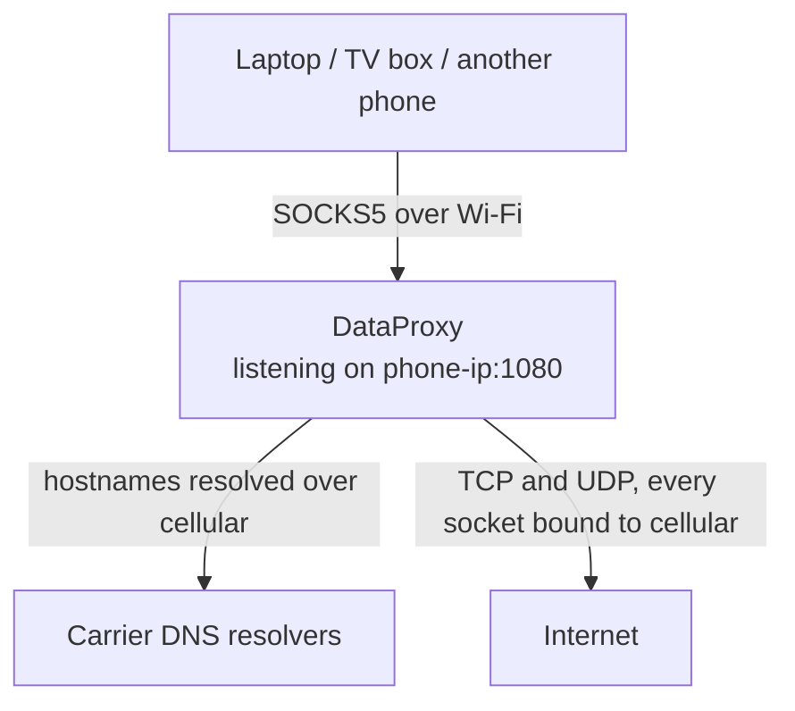
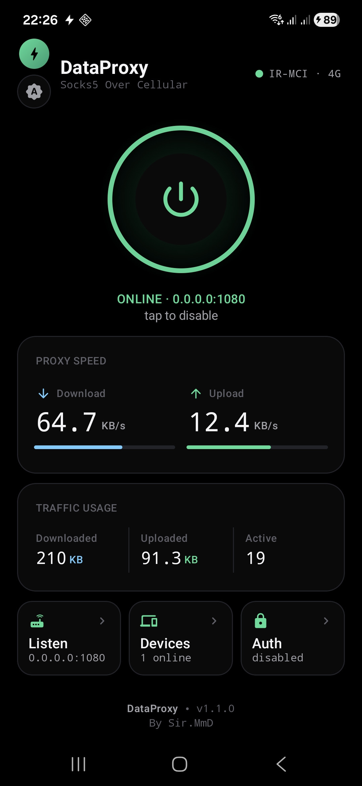

<div align="center">


# DataProxy

SOCKS5 proxy for Android that pins outbound traffic to the cellular network.

[](https://github.com/Sir-MmD/dataproxy/releases/latest)
[](LICENSE)
[](https://developer.android.com)
[](https://kotlinlang.org)

</div>

## What it does

DataProxy runs a SOCKS5 server on your phone. Clients on the same Wi-Fi point at
`phone-ip:1080`, and every socket the proxy opens is bound to the cellular
network, regardless of which network Android treats as the default.



The listener stays on the Wi-Fi interface so clients can reach it, while TCP,
UDP and DNS all leave over cellular. There is no VPN service, no root, no
iptables rules and no tethering. Only the sockets DataProxy opens are affected;
the rest of the phone keeps using Wi-Fi normally.

<div align="center">
  
</div>

## Install

Current release: **v1.3**

Grab `DataProxy-v1.3.apk` from
[Releases](https://github.com/Sir-MmD/dataproxy/releases/latest).
Requires Android 8.0 or newer.

## Usage

1. Open the app and grant the permissions it asks for.
2. Pick a listen address and port under **Listen** (default `0.0.0.0:1080`).
3. Optionally set a username and password under **Auth**.
4. Tap the power button.

Then point your client at the phone's IP on that port.

Use remote DNS so hostnames resolve over cellular rather than on the client:

| Client | Setting |
|---|---|
| curl | `--socks5-hostname`, or a `socks5h://` URL |
| Firefox | enable "Proxy DNS when using SOCKS v5" |
| Chrome | uses remote DNS with SOCKS5 already |

## Staying alive in the background

Android, and Samsung, Xiaomi, Huawei and OnePlus in particular, will kill a
background proxy to save battery. The **Anti-Kill** screen shows which of the
relevant settings are still missing and links straight to them: battery
optimisation, auto-launch, background activity and the Recents lock. It can also
restart the proxy automatically after a reboot.

## Protocol support

- `CONNECT` (TCP) and `UDP ASSOCIATE`, per RFC 1928
- Username/password authentication per RFC 1929, toggleable without restarting
- IPv4, IPv6 and domain address types
- Hostnames resolved through the cellular link's own DNS servers
- `BIND` is not implemented and returns `REP_COMMAND_NOT_SUPPORTED`

## Limitations

**IPv6 depends on your carrier.** If the APN is IPv4 only, the cellular link has
no IPv6 route, so IPv6-only destinations are unreachable. The proxy reports them
as network-unreachable, and clients will usually then resolve those names
themselves over whatever network they can reach.

**A SOCKS5 proxy cannot guarantee DNS privacy.** It only ever sees the names a
client chooses to send it. If a client resolves a hostname locally and connects
by IP, that lookup never reaches the phone. Enable remote DNS on the client.

## Permissions

| Permission | Why |
|---|---|
| `INTERNET` | Outbound sockets |
| `ACCESS_NETWORK_STATE` | Request and hold the cellular network handle |
| `FOREGROUND_SERVICE`, `FOREGROUND_SERVICE_SPECIAL_USE` | Keep running with the screen off |
| `POST_NOTIFICATIONS` | Status notification (Android 13+) |
| `READ_BASIC_PHONE_STATE` | Operator name and radio type in the header |
| `RECEIVE_BOOT_COMPLETED` | Optional auto-start after reboot |
| `WAKE_LOCK` | Hold the CPU awake while proxying |
| `REQUEST_IGNORE_BATTERY_OPTIMIZATIONS` | Prompt to exempt the app from Doze |

Nothing is collected or sent anywhere. Traffic counters and the device list are
in-memory only and reset when the proxy stops.

## Building

```bash
./gradlew :app:assembleRelease
```

Needs JDK 17 and Android SDK 36. Signing is optional: without a keystore at
`app/keystore/dataproxy-release.jks` the build produces an unsigned APK.

## License

MIT. See [LICENSE](LICENSE).
